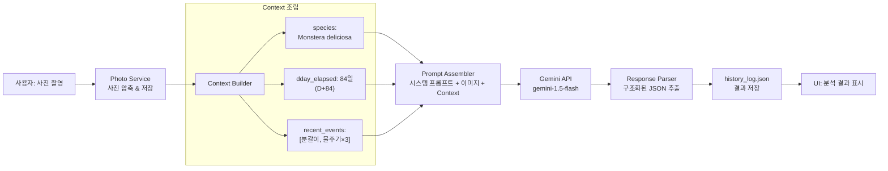
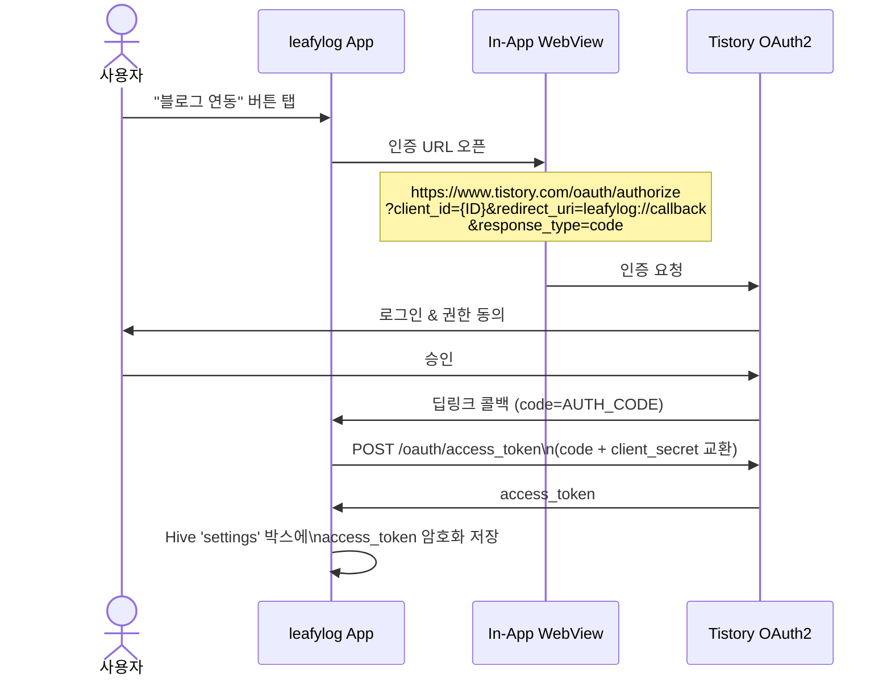
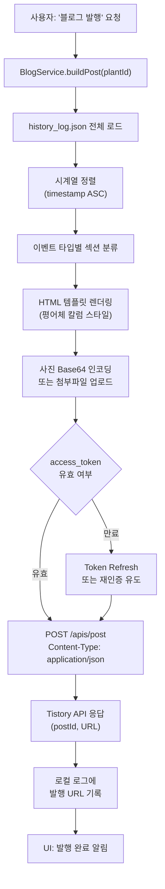
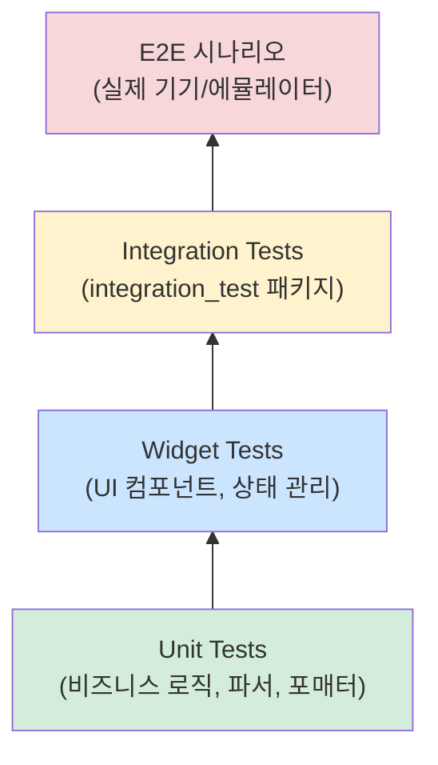

# leafylog 기술 명세서 (Technical Specification)

**버전**: 1.0.0  
**작성일**: 2026-04-09  
**프로젝트**: leafylog — 독립형 AI 식물 관리 앱  
**아키텍처 원칙**: 서버리스(Serverless) · 로컬 우선(Local-First) · AI 보조(AI-Augmented)

> **개발 단계 구분**  
> - **1차 개발 범위**: 섹션 1~3, 5~6 (핵심 기능: 식물 관리, AI 분석, 보안/테스트)  
> - **확장 기능 (2차)**: 섹션 4 — Tistory 연동 (1차 개발 및 테스트 완료 후 착수)

---

## 목차

1. [시스템 아키텍처 개요](#1-시스템-아키텍처-개요)
2. [데이터 및 저장소 설계](#2-데이터-및-저장소-설계)
3. [AI 로직 — 하이브리드 식별 파이프라인](#3-ai-로직--하이브리드-식별-파이프라인)
4. [Tistory 연동 설계](#4-tistory-연동-설계) *(확장 기능 — 2차 개발)*
5. [보안 및 품질 전략](#5-보안-및-품질-전략)
6. [리스크 & 대응책 매트릭스](#6-리스크--대응책-매트릭스)

---

## 1. 시스템 아키텍처 개요

### 1.1 기술 스택

| 레이어 | 기술 | 선택 근거 |
|---|---|---|
| UI/Framework | Flutter 3.x (Android) | 단일 코드베이스, 고성능 렌더링 |
| 로컬 NoSQL DB | Hive 2.x | 스키마리스, 암호화 지원, Flutter 네이티브 |
| 로컬 파일 시스템 | `path_provider` + `dart:io` | 사진·JSON 구조적 저장 |
| AI 엔진 | Google Gemini API (gemini-1.5-flash) | 멀티모달(이미지+텍스트) 지원, MVP 모바일 환경 Latency 최소화 |
| 블로그 연동 | Tistory REST API v1 + OAuth2 | 국내 주요 블로그 플랫폼 |
| 환경변수 관리 | `flutter_dotenv` | API 키 소스코드 분리 |
| 테스트 | `flutter_test` + `integration_test` | 유닛~E2E 전 계층 커버 |

### 1.2 전체 데이터 흐름도

```mermaid
flowchart TD
    subgraph DEVICE["스마트폰 (Android)"]
        direction TB
        UI["Flutter UI Layer"]
        
        subgraph LOCAL_STORAGE["로컬 저장소"]
            HIVE["Hive DB\n(앱 설정·메타데이터)"]
            FS["파일 시스템\n(사진 · JSON 로그)"]
            PLANTS_JSON["plants.json\n(Master Index)"]
            HIST_JSON["history_log.json\n(식물별 이력)"]
        end
        
        subgraph APP_LOGIC["앱 비즈니스 로직"]
            AI_SVC["AI Service\n(Gemini 호출·파싱)"]
            BLOG_SVC["Blog Service\n(HTML/MD 생성)"]
            PHOTO_SVC["Photo Service\n(촬영·명명·저장)"]
        end
    end

    subgraph CLOUD["클라우드 (외부 API)"]
        GEMINI["Google Gemini API\n(gemini-1.5-flash)"]
        TISTORY["Tistory REST API\n(OAuth2)"]
    end

    USER(["사용자"]) -->|촬영 / 조회 요청| UI
    UI --> PHOTO_SVC
    PHOTO_SVC -->|YYYYMMDD_HHMMSS_PlantID.jpg| FS
    UI --> AI_SVC
    AI_SVC -->|사진 + Context(종·D-Day)| GEMINI
    GEMINI -->|분석 결과 JSON| AI_SVC
    AI_SVC -->|결과 파싱 후 기록| HIST_JSON
    HIST_JSON --> PLANTS_JSON
    HIVE <-->|설정·캐시| APP_LOGIC
    UI --> BLOG_SVC
    BLOG_SVC -->|시계열 로그 병합| HIST_JSON
    BLOG_SVC -->|OAuth2 + HTML Post| TISTORY
    TISTORY -->|발행 결과 URL| UI
    UI -->|결과 표시| USER
```

### 1.3 모듈 구조 (Flutter 디렉토리)

```
lib/
├── core/
│   ├── config/          # 환경변수 로딩, 앱 상수
│   ├── di/              # 의존성 주입 (get_it)
│   └── utils/           # 날짜 포매터, UUID 생성기 등
├── data/
│   ├── local/
│   │   ├── hive/        # Hive 어댑터, 박스 정의
│   │   └── file/        # FileSystemRepository (JSON·사진 I/O)
│   └── remote/
│       ├── gemini/      # GeminiApiClient
│       └── tistory/     # TistoryApiClient, OAuth2Handler
├── domain/
│   ├── entities/        # Plant, HealthLog, AnalysisResult
│   ├── repositories/    # 인터페이스 정의
│   └── usecases/        # AnalyzePlant, PublishBlogPost 등
├── presentation/
│   ├── pages/
│   └── widgets/
└── main.dart
```

---

## 2. 데이터 및 저장소 설계

### 2.1 파일 시스템 디렉토리 구조

앱 전용 저장 경로: `getApplicationDocumentsDirectory()`

```
[AppDocDir]/
└── leafylog/
    ├── plants.json                          ← Master Index
    └── plants/
        └── {UUID}/                          ← 식물 고유 디렉토리
            ├── history_log.json             ← 해당 식물 전체 이력
            └── photos/
                ├── 20260409_143022_a1b2c3d4.jpg
                └── 20260410_091500_a1b2c3d4.jpg
```

> **설계 원칙 (네트워크 장비 이력 관리 참조)**: 각 식물을 네트워크 장비 1대로 취급한다. UUID는 장비의 Serial Number에 해당하며, `history_log.json`은 해당 장비의 변경 이력 로그(Change Log)다. Master Index(`plants.json`)는 NMS(Network Management System)의 인벤토리 테이블과 동일한 역할을 수행한다.

### 2.2 Master Index: `plants.json`

```json
{
  "version": 1,
  "last_updated": "2026-04-09T14:30:22+09:00",
  "plants": [
    {
      "id": "a1b2c3d4-e5f6-7890-abcd-ef1234567890",
      "display_name": "몬스테라 델리시오사",
      "species": "Monstera deliciosa",
      "registered_at": "2026-01-15T09:00:00+09:00",
      "thumbnail": "20260409_143022_a1b2c3d4.jpg",
      "watering_interval_days": 7,
      "dday_anchor": "2026-01-15",
      "tags": ["실내", "관엽"],
      "is_archived": false
    }
  ]
}
```

| 필드 | 타입 | 설명 |
|---|---|---|
| `id` | UUID v4 (String) | 식물 고유 식별자. 영구 불변 |
| `species` | String | AI Context 주입용 학명 또는 일반명 |
| `dday_anchor` | ISO 8601 Date | D-Day 계산 기준일 (분갈이, 입양일 등) |
| `watering_interval_days` | int | 물주기 알림 기준값 |
| `is_archived` | bool | 식물 삭제 대신 아카이브 처리 (이력 보존) |

### 2.3 식물 이력 로그: `history_log.json`

```json
{
  "plant_id": "a1b2c3d4-e5f6-7890-abcd-ef1234567890",
  "entries": [
    {
      "entry_id": "log_20260409_143022",
      "timestamp": "2026-04-09T14:30:22+09:00",
      "event_type": "AI_ANALYSIS",
      "photo_file": "20260409_143022_a1b2c3d4.jpg",
      "ai_result": {
        "health_score": 82,
        "detected_issues": ["하엽 황화", "과습 의심"],
        "recommendations": ["물주기 주기를 10일로 늘릴 것", "직사광선 피할 것"],
        "confidence": 0.91,
        "raw_response_hash": "sha256:abcdef..."
      },
      "user_note": "새 흙으로 분갈이 후 첫 분석",
      "context_snapshot": {
        "species": "Monstera deliciosa",
        "dday_elapsed": 84
      }
    },
    {
      "entry_id": "log_20260410_091500",
      "timestamp": "2026-04-10T09:15:00+09:00",
      "event_type": "WATERING",
      "photo_file": null,
      "user_note": "물 300ml 공급"
    }
  ]
}
```

**이벤트 타입 정의**:

| `event_type` | 설명 |
|---|---|
| `AI_ANALYSIS` | Gemini 분석 수행 및 결과 저장 |
| `WATERING` | 물주기 수동 기록 |
| `FERTILIZING` | 비료 공급 기록 |
| `REPOTTING` | 분갈이 기록 |
| `USER_NOTE` | 자유 메모 |
| `HEALTH_CHECK` | 사진 없는 상태 점검 |

### 2.4 사진 명명 규칙

```
YYYYMMDD_HHMMSS_PlantID(8자리).jpg
예시: 20260409_143022_a1b2c3d4.jpg
```

- `PlantID`는 UUID의 앞 8자리(하이픈 제외)를 사용한다.
- 파일명 자체가 촬영 시각과 식물 정보를 포함하므로 별도 DB 조회 없이 파일명만으로 역추적 가능하다.
- 저장 경로: `[AppDocDir]/leafylog/plants/{FULL_UUID}/photos/`

### 2.5 Hive 저장 항목

파일 시스템에 저장하기 부적합한 **구조화된 앱 상태**는 Hive에 저장한다.

| Hive Box 이름 | 저장 내용 | 이유 |
|---|---|---|
| `settings` | 테마, 알림 설정, OAuth 토큰 | 빠른 키-값 접근 |
| `cache` | Gemini 최근 응답 캐시 (TTL 24h) | API 호출 절감 |
| `notification_schedule` | 물주기 알림 예약 데이터 | 앱 재시작 후 복원 |

---

## 3. AI 로직 — 하이브리드 식별 파이프라인

### 3.1 AI 오인식 방지 전략 (Context 주입)

AI가 사진만으로 식물을 분석할 경우 비슷한 식물 종을 혼동하거나 일반적인 조언을 제공하는 문제가 발생한다. 이를 해결하기 위해 **사용자가 등록한 종(Species) 정보를 Gemini 프롬프트의 시스템 컨텍스트로 주입**한다.



### 3.2 Gemini 프롬프트 설계

**시스템 프롬프트 템플릿**:

```
당신은 전문 식물 병리학자입니다.
아래 제공된 컨텍스트 정보를 반드시 참고하여 분석하십시오.

[식물 정보]
- 등록 종명: {species}
- 관리 경과일: D+{dday_elapsed}
- 최근 이벤트: {recent_events_summary}

[분석 요청]
첨부된 사진을 바탕으로 이 식물({species})의 건강 상태를 분석하십시오.
다른 식물로 오인하지 말고 반드시 위 종명을 기준으로 분석하십시오.

[응답 형식] 반드시 아래 JSON 형식으로만 응답하십시오:
{
  "health_score": 0-100,
  "detected_issues": ["이슈1", "이슈2"],
  "recommendations": ["권장사항1", "권장사항2"],
  "confidence": 0.0-1.0,
  "summary": "한 줄 요약"
}
```

### 3.3 분석 파이프라인 구현 규격

```dart
// domain/usecases/analyze_plant.dart (의사코드 수준 명세)

class AnalyzePlantUseCase {
  Future<AnalysisResult> execute(AnalysisRequest request) async {
    // 1. 사진 압축 (Gemini 업로드 한도: 20MB, 권장 2MB 이하)
    final compressedPhoto = await _photoService.compress(
      request.photoPath,
      maxSizeKB: 1500,
      quality: 85,
    );

    // 2. 컨텍스트 조립
    final context = AnalysisContext(
      species: request.plant.species,
      ddayElapsed: _calcDday(request.plant.ddayAnchor),
      recentEvents: await _logRepo.getRecentEvents(request.plant.id, limit: 5),
    );

    // 3. Gemini API 호출 (재시도 로직 포함)
    final rawResponse = await _geminiClient.analyze(
      image: compressedPhoto,
      context: context,
      retryPolicy: RetryPolicy(maxAttempts: 3, backoffMs: 1000),
    );

    // 4. 응답 파싱 및 유효성 검증
    final result = _parseAndValidate(rawResponse);

    // 5. 로컬 저장
    await _logRepo.appendEntry(request.plant.id, LogEntry(
      eventType: EventType.aiAnalysis,
      aiResult: result,
      contextSnapshot: context.toSnapshot(),
    ));

    return result;
  }
}
```

**재시도 정책**:

| 시나리오 | 처리 방식 |
|---|---|
| HTTP 429 (Rate Limit) | Exponential Backoff: 1s → 2s → 4s |
| HTTP 503 (서버 오류) | 최대 3회 재시도 후 사용자 알림 |
| 응답 JSON 파싱 실패 | `raw_response`를 로컬 저장 후 재파싱 시도 |
| 네트워크 없음 | 오프라인 모드 전환, 로컬 로그만 조회 가능 |

---

## 4. Tistory 연동 설계 *(확장 기능 — 2차 개발)*

> **적용 시점**: 섹션 1~3의 핵심 기능(식물 등록, AI 분석, 로컬 저장) 개발 완료 및 E2E 테스트 통과 후 착수한다. 1차 빌드에서는 이 섹션의 코드를 포함하지 않는다.

### 4.1 OAuth2 인증 흐름



**딥링크 설정** (`AndroidManifest.xml`):
```xml
<intent-filter>
    <action android:name="android.intent.action.VIEW"/>
    <category android:name="android.intent.category.DEFAULT"/>
    <category android:name="android.intent.category.BROWSABLE"/>
    <data android:scheme="leafylog" android:host="callback"/>
</intent-filter>
```

### 4.2 블로그 포스트 생성 로직



**HTML 출력 포맷 (평어체 칼럼 스타일)**:

```html
<article class="leafylog-post">
  <header>
    <h1>몬스테라 관찰 일기 — 84일의 기록</h1>
    <p class="meta">2026년 4월 9일 · leafylog 자동 생성</p>
  </header>

  <section class="intro">
    <p>집에 들여온 지 84일이 지났다. 처음엔 작은 화분 하나였는데,
    이제는 제법 잎을 키워냈다.</p>
  </section>

  <section class="timeline">
    <div class="entry">
      <time>2026년 1월 20일</time>
      <p>첫 물을 줬다. 흙이 꽤 말라있었다.</p>
    </div>
    <!-- ... 이하 이벤트 반복 ... -->
  </section>

  <section class="ai-report">
    <h2>AI 건강 진단 리포트</h2>
    <p>건강 점수: <strong>82점</strong></p>
    <p>주요 소견: 하엽 황화 현상이 관찰되나, 전체적인 생장은 양호한 편이다.</p>
  </section>
</article>
```

### 4.3 Tistory API 연동 규격

| API | 메서드 | 엔드포인트 | 주요 파라미터 |
|---|---|---|---|
| 포스트 작성 | POST | `/apis/post` | `blogName`, `title`, `content`, `visibility` |
| 포스트 수정 | POST | `/apis/post/modify` | `blogName`, `postId`, `content` |
| 파일 첨부 | POST | `/apis/post/attach` | `blogName`, `uploadedfile` (multipart) |
| 블로그 정보 | GET | `/apis/blog/info` | `access_token` |

**공통 요청 헤더**:
```
Authorization: Bearer {access_token}
Content-Type: application/json
```

---

## 5. 보안 및 품질 전략

### 5.1 API 키 보안

**계층적 보안 전략**:

```
레벨 1: 소스코드 분리
  .env 파일에 API 키 저장
  .gitignore에 .env 등록 (절대 커밋 금지)

레벨 2: 런타임 보호
  flutter_dotenv로 런타임 로딩
  앱 메모리에서만 참조, 화면 출력 금지

레벨 3: 저장소 보호
  OAuth access_token: Hive + HiveAesCipher(256-bit AES)
  암호화 키: flutter_secure_storage (Android Keystore 연동)

레벨 4: 빌드 보호
  ProGuard/R8 난독화 활성화
  APK에서 .env 리소스 추출 방지 검증
```

**.env 파일 구조**:
```dotenv
GEMINI_API_KEY=your_gemini_api_key_here
TISTORY_CLIENT_ID=your_tistory_client_id_here
TISTORY_CLIENT_SECRET=your_tistory_client_secret_here
TISTORY_REDIRECT_URI=leafylog://callback
```

**보안 체크리스트**:
- [ ] `.env`가 `.gitignore`에 포함되어 있는가
- [ ] CI/CD 환경변수로 API 키 주입 (GitHub Actions Secrets 등)
- [ ] `flutter_secure_storage`로 토큰 암호화 저장
- [ ] 릴리즈 빌드에서 `--obfuscate --split-debug-info` 플래그 적용
- [ ] 네트워크 트래픽 Certificate Pinning 적용 (선택적)

### 5.2 E2E 테스트 전략

**테스트 계층 구조**:



**핵심 E2E 시나리오** (`integration_test/`):

```dart
// integration_test/plant_lifecycle_test.dart

void main() {
  IntegrationTestWidgetsFlutterBinding.ensureInitialized();

  testWidgets('식물 등록 → AI 분석 → 블로그 발행 전체 흐름', (tester) async {
    // 1. 앱 시작 및 초기화 검증
    await tester.pumpWidget(const LeafyLogApp());
    await tester.pumpAndSettle();

    // 2. 새 식물 등록
    await tester.tap(find.byKey(const Key('add_plant_fab')));
    await tester.enterText(find.byKey(const Key('plant_name_field')), '테스트 몬스테라');
    await tester.enterText(find.byKey(const Key('species_field')), 'Monstera deliciosa');
    await tester.tap(find.byKey(const Key('save_plant_button')));
    await tester.pumpAndSettle();

    // 3. plants.json 생성 검증
    final dir = await getApplicationDocumentsDirectory();
    expect(File('${dir.path}/leafylog/plants.json').existsSync(), isTrue);

    // 4. AI 분석 요청 (Mock Gemini Client 사용)
    await tester.tap(find.byKey(const Key('analyze_button')));
    await tester.pumpAndSettle(const Duration(seconds: 5));

    // 5. 분석 결과 표시 검증
    expect(find.byKey(const Key('health_score_display')), findsOneWidget);

    // 6. history_log.json에 AI_ANALYSIS 엔트리 기록 검증
    final logFile = File('${dir.path}/leafylog/plants/.../history_log.json');
    final log = jsonDecode(logFile.readAsStringSync());
    expect(log['entries'].last['event_type'], equals('AI_ANALYSIS'));
  });
}
```

**테스트 대역(Test Double) 전략**:

| 테스트 대상 | 대역 방식 | 이유 |
|---|---|---|
| Gemini API | Mock (사전 정의 응답) | API 비용 절감, 일관성 보장 |
| Tistory API | Mock + WireMock | 실제 블로그 발행 방지 |
| 파일 시스템 | 실제 임시 디렉토리 | 실제 I/O 동작 검증 |
| Hive DB | 실제 인메모리 박스 | 실제 직렬화 동작 검증 |

---

## 6. 리스크 & 대응책 매트릭스

| # | 리스크 | 발생 가능성 | 영향도 | 엔지니어링 대응책 |
|---|---|---|---|---|
| R-01 | **로컬 저장소 부족** (사진 누적으로 저장공간 고갈) | 중 | 높음 | ① 저장 공간 임계치(500MB) 경보 UI ② 사진 자동 압축(> 1.5MB시 리사이징) ③ 아카이브 기능: 오래된 사진을 저해상도 썸네일로 교체 |
| R-02 | **Gemini API 호출 실패** (네트워크 단절, 할당량 초과) | 중 | 중간 | ① Exponential Backoff 재시도 (최대 3회) ② 오프라인 모드: API 없이 로컬 로그 조회만 허용 ③ 마지막 성공 분석 결과 캐시 (Hive, TTL 24h) |
| R-03 | **AI 오인식** (잘못된 식물 진단) | 높음 | 높음 | ① 종(Species) Context 주입 (본 명세 3.1항) ② Confidence Score 표시 (0.7 미만 시 "낮은 신뢰도" 경고) ③ 사용자 피드백 버튼("오진 신고")으로 수동 보정 |
| R-04 | **Tistory OAuth 토큰 만료** *(2차)* | 중 | 낮음 | ① 토큰 만료 72h 전 사전 갱신 시도 ② 갱신 실패 시 재인증 유도 (딥링크 재개) ③ 미발행 포스트는 임시저장 상태로 로컬 보관 |
| R-05 | **Hive 박스 데이터 손상** | 낮음 | 높음 | ① `HiveBox.compact()` 주기적 실행 ② JSON 파일 시스템을 1차 진실 공급원(Source of Truth)으로, Hive는 캐시로만 사용 ③ 앱 시작 시 Hive 초기화 실패 → JSON 파일로 자동 복원 |
| R-06 | **UUID 중복** | 매우 낮음 | 높음 | UUID v4 사용 (충돌 확률: 1/2^122) + 등록 시점 `plants.json` 중복 검사 |
| R-07 | **API 키 유출** (APK 리버스 엔지니어링) | 낮음 | 매우 높음 | ① `.env` Git 제외 ② ProGuard 난독화 ③ 유출 감지 시 즉시 키 폐기 절차 문서화 ④ Gemini API 키에 IP/Android Package 제한 설정 |
| R-08 | **대용량 JSON 로그 파싱 지연** (이력 수백 건 누적) | 중 | 낮음 | ① Isolate를 통한 백그라운드 파싱 ② 최근 30건만 로드하는 페이지네이션 쿼리 ③ 전체 통계는 별도 집계 캐시 유지 |
| R-09 | **기기 분실/파손에 의한 로컬 데이터 영구 증발** (식물 이력·사진 전체 손실) | 중 | 매우 높음 | ① Android OS 기본 **Auto Backup (Google Drive 연동)** 허용: `AndroidManifest.xml`에 `android:allowBackup="true"` 설정 — **단, 실제 백업은 사용자 기기의 'Google One 백업' 설정이 활성화된 경우에만 동작** ② 앱 최초 실행 시 백업 설정 활성화를 안내하는 온보딩 메시지 노출 ③ Zero-Cost: 별도 서버 없이 OS 레벨에서 자동 백업 (최대 25MB, Google Drive 앱 데이터 공간) |

---

## 부록

### A. 주요 패키지 의존성

```yaml
# pubspec.yaml (핵심 패키지)
dependencies:
  flutter:
    sdk: flutter
  hive: ^2.2.3
  hive_flutter: ^1.1.0
  path_provider: ^2.1.0
  flutter_dotenv: ^5.1.0
  flutter_secure_storage: ^9.0.0
  google_generative_ai: ^0.4.0   # Gemini SDK
  image: ^4.1.0                  # 사진 압축/리사이징
  uuid: ^4.0.0
  get_it: ^7.6.0                 # DI
  go_router: ^13.0.0
  flutter_riverpod: ^2.4.9       # 상태 관리

dev_dependencies:
  hive_generator: ^2.0.0
  build_runner: ^2.4.0
  flutter_test:
    sdk: flutter
  integration_test:
    sdk: flutter
  mockito: ^5.4.0
```

### B. 빌드 명령어

```bash
# 개발 빌드
flutter run --dart-define-from-file=.env

# 릴리즈 빌드 (난독화 포함)
flutter build apk --release \
  --dart-define-from-file=.env \
  --obfuscate \
  --split-debug-info=build/symbols

# E2E 테스트 실행
flutter test integration_test/ \
  --dart-define-from-file=.env.test
```

### C. 데이터 마이그레이션 전략

`plants.json`의 `version` 필드를 통해 스키마 버전을 관리한다. 앱 업데이트 시 `MigrationRunner`가 현재 버전을 확인하고 필요한 마이그레이션을 순차 실행한다.

```
v1 → v2: (예시) dday_anchor 필드 추가, 기존 registered_at 값으로 자동 채움
```
